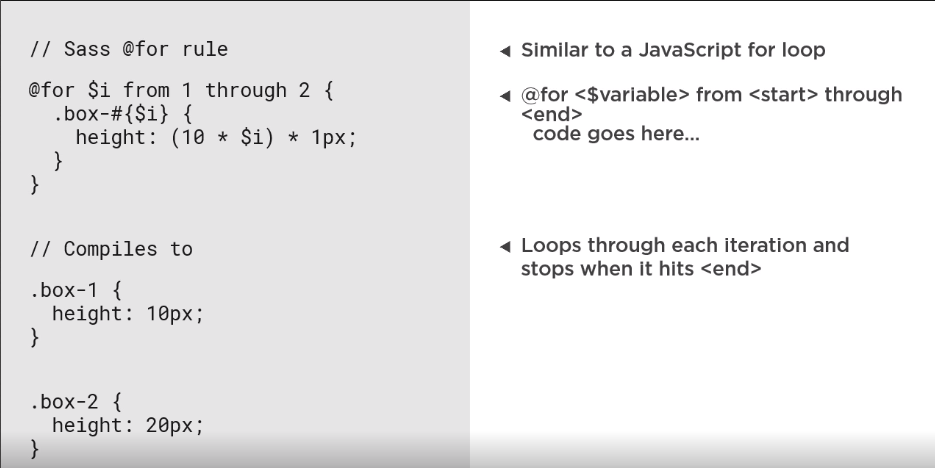

# CSS Style Guide

## Style Guide Patterns

Just an example how to classify or note down different parts of designs

| Globals       | HTML Elements | Components     |
| ------------- | ------------- | -------------- |
| Logos         | Typography    | Banners        |
| Colors        | Buttons       | Progress Bars  |
| Icons         | Forms         | Styled Lists   |
| Grids         |               | Cards          |
| Media Queries |               | Carousels      |
| Spacing       |               | Content Blocks |
| Alignment     |               | Avatars        |
|               |               | Tabs           |

## Folder Organization

```
└───assets
    ├───css (style-guide.css, styles.css)
    ├───font-icon
    │   └───fonts
    ├───img
    │   └───avatar
    ├───js
    │   └───libs
    ├───scss (style-guide.scss, styles.scss)
    │   └───partials (_reset.scss, _font-icons.scss, _functions.scss, _main.scss, _variables.scss)
    │       └───libs
    └───svg
        ├───avatar
        ├───icons
        └───logos
```

libs folder will contain files of plugins.

## Colors: Types

- Brand
- Warm
- Cool
- Grey
- Social Media
- States (Error, warning, etc.)

### Conventions

Naming:

- brand-primary ✔️
- brand_1, brandBlue ❌
- gray-cement ✔️
- gray-darkest ❌
- color-link, color-font ✔️
- link-color, font-color ❌

## Font/Text

Base line height ~ 1.5

Font-size: 14px usually used as base.

Headings and other font sizes are preferred to be pixel to percent.

## Best Practices

- Use 2 spaces for indentation
- Link parent and children with a common word for class naming
- use double-hyphen for modifiers i.e. which extend a base class with particular css e.g. list-block--profile
- One can use js- as a prefix to a class name that is being used by javascript only and has no styles

## Sass Maps

```
$map: (
    "key1": value1
);
```

E.g. creating map of colors

```
$colors: (
    "green": #3ABB8D
)
```

Use @each loop to generate classes named green and blue.

```
@each $name, $value in $colors {
    .#{$name} {
        color: $value;
    }
}
```

## Grid Anatomy

A grid always starts with a container that provides horizontal padding and max-width.

A row uses flex box and negative margins for alignment and offsetting column gutter.

Columns use horizontal padding as gutters. They may have different widths at different break points

```
<div class="container">
    <div class="row flex flex-wrap">
        <div class="col col-12 col-6-sm col-3-lg">
        </div>
    </div>
</div>
```


