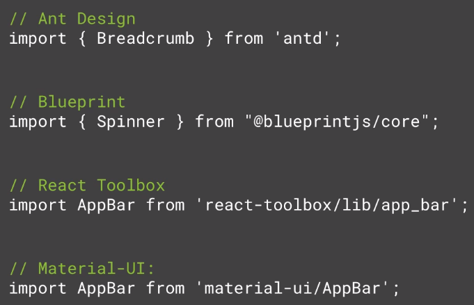

# Reusable React Components Art

## Tips

- Get HTML ID via prop to make the component really re-usable.

```
MyComponent.propTypes = {
  htmlId: PropTypes.string.isRequired
}
```

- Set Logical Defaults: conveys common use case

- Accessibility Matters

E.g. make tab indexes required field for focus related elements like inputs of form.

- Consider configuration prop

When a component may have lots of additional props in future (> 4 or 5) then its better to club in an object prop

Example:

```
<CustomerDetail customer={{
  firstName: "Pratik",
  lastName: "Kataria",
  title: "Software Engineer",
  office: "Home"
}}>
```

- Support Server Rendering

Don't assume your component is in a browser: 1. Avoid document or window calls & 2.Avoid using setTimeout

- Prefer separate, simple components to one complicated and highly customizable component.

## What is Atomic Design?

Language for describing components written at multiple layers of abstraction.

- Atoms: Basic Building blocks
- Molecules: Groups of two or more atoms
- Organisms: Groups of molecules functioning together

This was popularized by Brad Frost in book Atomic Design.

Atomic Design = Modular Design

## Atom

- You can't break an atom down any further
- Demonstrates base styles

### What Belongs in /components?


```
/Button
  Button.js
  Button.spec.js
  index.js
```

**Honor the underlying element's API. Example: value, maxLength and events (onFocus, onBlur...) in case of input**

**Avoid: userList and instead use: users**

**Use spread operator to transfer props {...props}**

```
const Hello = ({ name, ...rest }) =>
  <div {...rest}>Hi {name}!</div>
```

## Molecules

Grouping atoms together which creates simple, functional and reusable components.

Molecules should also have a single (but higher level) responsibility.

## Organisms

Keep organisms from making any API calls and care only about the molecules it has.

**Checkout [POSTCSS](https://github.com/postcss/postcss)**

## Styling and Themeing

Name Schemes: BEM (40%), OOCSS (15%), SMACSS (13%)

BEM stands for Block Element and Modifier.

### Why React Inline Styles


## Testing


The types of tests for UI are:

- Unit: focus is on business logic that makes the UI work. e.g. validation, calculations and data transformations.

- Interaction: e.g. a function is called when a specific element is clicked. A message displays when form is submitted. Instead of using actual browser we can use Enzyme to write the tests.

- Structural: html output is what's expected. Jest offers snapshot testing. Saves a copy of output for a given input. The only test needed if stateless. Snapshot testing stores a text based picture of component. Useful for non-interactive component. Snapshot testing is not for TDD and it is written after development.

- Style: Automated visual regression testing. Popular tools are BackstopJS, PhantomCSS & Casper

**Helper Libraries with Jest**

Enzyme

- Interaction tests
- Simulate clicks
- DOM queries

react-test-renderer

- Render Jest Snapshots

**Where to Run Tests**

Browser

- Karma, Testem

Healdess Browser

- PhantomJS (to be replaced by headless chrome)

In-memory DOM

- JSDOM (recommended)

**Continuous Integration**


## Publishing Package

Deciding import.

1. Named import

```
import {Label} from 'ps-react';
```

✔️ Most Concise
❌ Imports entire library
❌ Bloats bundle
❌ Need index.js at root

2. Write component to lib

```
import Label from 'ps-react/lib/Label';
```

✔️ Imports single component
✔️ No index.js at root needed
✔️ Most common
✔️ Simple build setup
❌ More typing for import

3. Import from Package Root

```
import Label from 'ps-react/Label';
```

✔️ Imports single component
✔️ No index.js at root needed
✔️ Concise - No /lib in path
❌ Custom build process that will publish components to the root of package directory. It involves generating package.json, copying assets and no .npmignore and run publish command from inside lib folder to generate



**Specifying files to ignore for npm publish**

1. .npmignore - list files to ignore
2. files array in package.json - list files to publish ✔️ (e.g. "files" : ["lib"])
3. Dedicated folder - copy files to publish

General .npmignore

```
Stories
src
config
scripts
docs
public
.editorconfig
```

**Decision of output formats**

1. ES5 with CommonJS ✔️
2. ES5 with ES module
3. Universal Module Definition


Node understands CommonJS format:

```
var jquery = require('jquery')
.
.
module.exports = myObj;
```

Babel transpiles our ES module:

```
import jQuery from 'jquery'
.
.
export default myObj;
```

**Why provide an ES Module Build?**

Modules are statically analyzable which helps in:

- Reliable autocompletion
- Tree shaking/dead code elimination
- Smaller bundle size

The way to provide such a build is to provide custom preset in .babelrc along with react.

```
const env = require('babel-preset-env').buildPreset;

module.exports = {
  "presets": [
    "env", {
      "es2015": {
        "modules": process.env.BABEL_ENV === 'es' ? false : 'commonjs'
      }
    }
  ]
}
```

In package.json:

```
"build:es": "cross-env BABEL_ENV=es babel ./src/components --out-file ./lib/index.es.js --ignore spec.js",
"module": "./lib/index.es.js"
```

**Why UMD?**

- Just slap a script tag on the page
- Exposes code on global variable
- No build needed - just add a script tag
- Friendly to experimentation in JSFiddle, JS Bin, etc.
- Useful for public components

**CommonJS Build**

```
"build:commonjs": "cross-env NODE_ENV=production babel ./src/components --out-dir ./lib --ignore spec.js"
```

**packages**

babel-cli, cross-env, rimraf, cpx

**css**

```
"build:css": "cpx \"./src/components/**/*.css\" ./lib"
```
